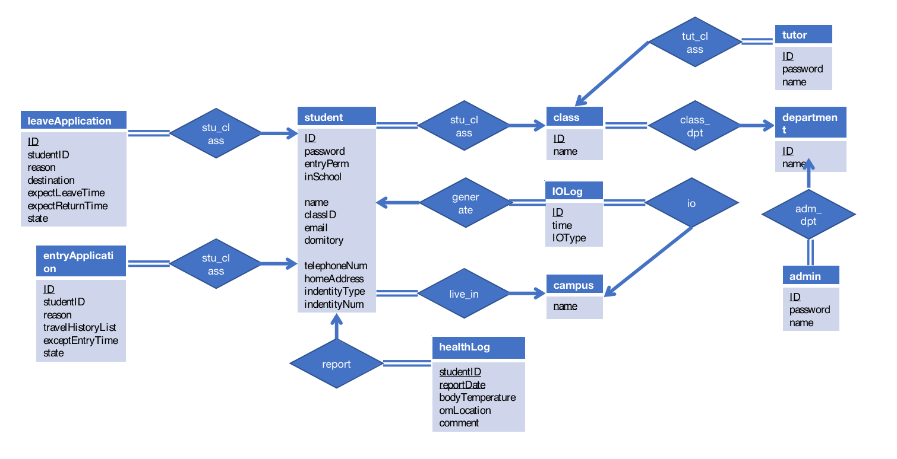

# 数据库PJ 实验报告
[toc]
## 设计的 ER 图

## 数据库表结构说明
### admin 
- 存储院系管理员的有关信息
- 主键为ID
```sql{.line-numbers}
CREATE TABLE `admin` (
  `ID` decimal(11,0) NOT NULL,
  `name` varchar(100) NOT NULL,
  `userpass` varchar(30) NOT NULL,
  `dptID` varchar(30) NOT NULL
);
```
### campus 
- 存储学校校区的有关信息
- 主键为name
```sql{.line-numbers}
CREATE TABLE `campus` (
  `name` varchar(30) NOT NULL
);
```
### class
- 存储班级有关信息
- class 主键为ID
- dptID外键依赖department的ID
```sql{.line-numbers}
CREATE TABLE `class` (
  `ID` varchar(30) NOT NULL,
  `name` varchar(100) NOT NULL,
  `dptID` varchar(30) DEFAULT NULL
);
```
### department
- 存储学校部门有关信息
- department 主键为ID
```sql{.line-numbers}
CREATE TABLE `department` (
  `ID` varchar(30) NOT NULL,
  `name` varchar(100) DEFAULT NULL
);
```
### entryApplication
- 存储入校申请的有关信息
- entryApplication 主键为ID
- studentID外键依赖student的ID
```sql{.line-numbers}
CREATE TABLE `entryApplication` (
  `ID` int NOT NULL,
  `studentID` decimal(11,0) DEFAULT NULL,
  `applyTime` timestamp NOT NULL,
  `travelHistoryList` varchar(500) NOT NULL,
  `expectEntryTime` timestamp NOT NULL,
  `reason` varchar(500) NOT NULL,
  `progress` varchar(30) CHARACTER SET utf8mb4 COLLATE utf8mb4_0900_ai_ci NOT NULL,
  `refuseReson` varchar(500) DEFAULT NULL
);
```
### healthLog 
- 存储每日健康日报的有关信息
- 主键为ID
- studentID外键依赖student的ID
```sql{.line-numbers}
CREATE TABLE `healthLog` (
  `studentID` decimal(11,0) NOT NULL,
  `reportDate` date NOT NULL,
  `reportTime` time NOT NULL,
  `bodyTemperature` decimal(3,1) NOT NULL,
  `onLocation` varchar(200) NOT NULL,
  `comments` varchar(500) CHARACTER SET utf8mb4 COLLATE utf8mb4_0900_ai_ci NOT NULL
);
```

### IOLog 
- 记录学生每次出入校
- 主键为ID，studentID外键依赖student的ID
```sql{.line-numbers}
CREATE TABLE `IOLog` (
  `studentID` decimal(11,0) NOT NULL,
  `IOTime` timestamp NOT NULL,
  `IOType` varchar(3) DEFAULT 'out',
  `campusName` varchar(30) DEFAULT NULL
);
```
### LeaveApplication 
- 记录学生离校申请
- 主键为ID
- studentID外键依赖student的ID
```sql{.line-numbers}
CREATE TABLE `leaveApplication` (
  `ID` int NOT NULL,
  `studentID` decimal(11,0) DEFAULT NULL,
  `applyTime` timestamp NOT NULL,
  `expectLeaveTime` timestamp NOT NULL,
  `expectReturnTime` timestamp NOT NULL,
  `reason` varchar(500) NOT NULL,
  `progress` varchar(30) NOT NULL,
  `destination` varchar(200) NOT NULL,
  `refuseReson` varchar(500) DEFAULT NULL
);
```
### student 
- 记录学生个人信息及出入校权限、是否在校等信息
- 主键为ID
```sql{.line-numbers}
CREATE TABLE `student` (
  `ID` decimal(11,0) NOT NULL,
  `name` varchar(30) NOT NULL,
  `userpass` varchar(30) NOT NULL,
  `entryPerm` tinyint(1) NOT NULL DEFAULT '0',
  `inSchool` tinyint(1) NOT NULL DEFAULT '0',
  `classID` varchar(30) DEFAULT NULL,
  `email` varchar(30) DEFAULT NULL,
  `domitory` varchar(30) DEFAULT NULL,
  `telephoneNum` varchar(30) DEFAULT NULL,
  `homeAddress` varchar(100) DEFAULT NULL,
  `indentityType` varchar(30) DEFAULT NULL,
  `indentityNum` decimal(30,0) NOT NULL,
  `liveIn` varchar(30) DEFAULT NULL
);
```
### superAdmin 
- 记录超级用户有关信息
- 主键为ID
```sql{.line-numbers}
CREATE TABLE `superAdmin` (
  `ID` decimal(11,0) NOT NULL,
  `name` varchar(100) NOT NULL,
  `userpass` varchar(30) NOT NULL
);
```
### tutor
- 记录班级辅导员有管信息
- 主键为ID
- classID外键依赖class的ID
```sql{.line-numbers}
CREATE TABLE `tutor` (
  `ID` varchar(30) NOT NULL,
  `name` varchar(100) NOT NULL,
  `userpass` varchar(30) NOT NULL,
  `classID` varchar(30) NOT NULL
) ;
```
## view studentBelonging
由于经常需要按照学生所在班级、部门作为筛选条件，我们设计了`studentBelonging`视图来简化联查操作。
```sql
CREATE VIEW studentBelonging AS  
SELECT student.ID, student.classID, class.dptID  
FROM student, class, department  
WHERE student.classID=class.ID 
AND class.dptID=department.ID
```
## 索引定义说明
学生经常会查询本人的出入校申请，在统计离校时间、平均离校时长时也会把学号作为聚合条件。因此在存储出入校申请和进出校记录的表中添加了学号索引。
```sql{.line-numbers}
ALTER TABLE leaveApplication ADD INDEX index_studentID(studentID);
ALTER TABLE entryApplication ADD INDEX index_studentID(studentID);
ALTER TABLE IOLog ADD INDEX index_studentID(studentID);
```
## 核心功能的SQL语句说明
### 原子性与一致性
1. 实现批准入校申请后打开权限，每隔15秒检查当前表格内已经审批成功的入校申请，并修改学生入校权限。

```sql{.line-numbers}
CREATE EVENT give_perm ON SCHEDULE AT CURRENT_TIMESTAMP + INTERVAL 15 SECOND
    DO
    UPDATE student, entryApplication
    SET entryPerm=1,  progress='finish'
    WHERE student.ID=entryApplication.studentID  AND progress='success';
```

2. 批准离校申请24小时后关闭权限，每天定时检查已经审批成功的离校申请，并修改学生的入校权限。
```sql{.line-numbers}
CREATE EVENT change_perm ON SCHEDULE AT CURRENT_TIMESTAMP + INTERVAL 1 DAY
    DO
    UPDATE student, leaveApplication
    SET entryPerm=0,  progress='finish'
    WHERE student.ID=leaveApplication.studentID  AND progress='success';
```

3. 出入校打卡的同时修改在校状态
   使用事务实现，若出入校或修改状态任意语句失败，则回滚。